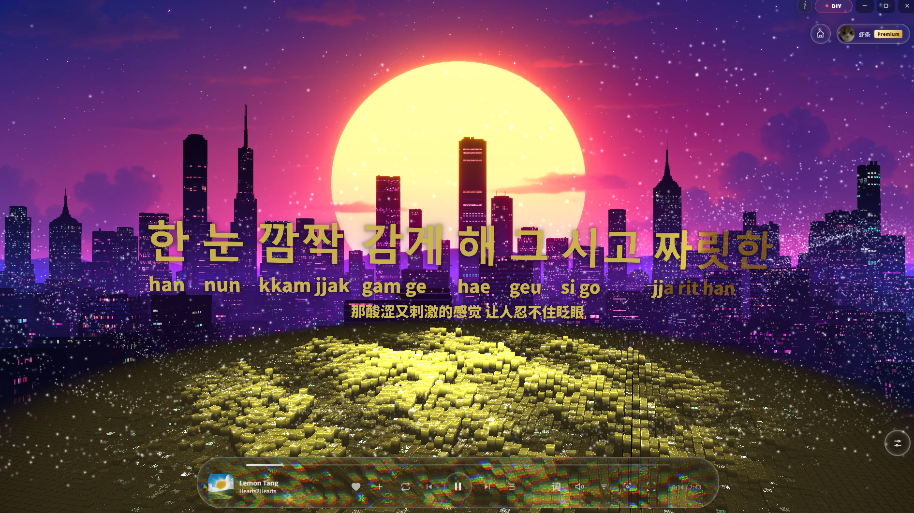

# Better Radio




**Better Radio 是为 Spotify 专门打造的舞台粒子效果视觉歌词显示器。**

它不接管音乐音源：歌曲仍由 Spotify 客户端播放，Better Radio 负责同步当前播放、控制 Spotify、捕获桌面音频，并把逐字歌词、翻译、音译、粒子舞台、电影镜头和 3D 歌单架组合成沉浸式视觉体验。

## 当前版本

- 正式版本：`2.0.0`
- Windows 安装包：`Better-Radio-2.0.0-Setup.exe`
- 支持平台：Windows x64

Better Radio 2.0.0 是独立应用，不覆盖或读取旧 Mineradio：它拥有独立的应用 ID、安装目录、可执行文件、登录分区和 `%APPDATA%\Better Radio` 用户数据目录。

## 2.0.0 核心体验

### Spotify 专属播放舞台

- Spotify OAuth Authorization Code with PKCE 登录，无需 Client Secret。
- 同步当前歌曲、进度、播放状态、歌单、资料库与设备。
- 支持播放、暂停、上一首、下一首、进度和设备切换。
- 捕获 Windows 桌面音频，让粒子和镜头响应 Spotify 实际声音。
- Spotify 首页、搜索、资料库、歌单与空闲态使用严格白名单 API。

### Apple Music 风格逐字歌词

- 全新的 Apple Music 歌词 Beta 多行舞台，当前歌词居中偏上，过去与未来歌词自然排布。
- 支持 QQ QRC 逐字歌词、翻译、韩语/日语本地音译、歌词选择、单曲与全局延迟。
- 可选 Apple Music TTML 歌词源，保留真实逐字时间、背景人声、对唱和重叠时间轴；获取成功后在本地缓存原始 TTML。
- Apple Music 无翻译时可启用“翻译优先”，整套回退到带翻译的 QQ 歌词，避免混合不同时间轴。
- 支持最多三句重叠高亮、背景人声独立时钟、长音动态辉光、逐字上浮、Apple Music 式呼吸点和提前换行。
- 韩语音译按源歌词空格建立词列，保留音节间距与 Apple TTML 的真实内部计时。
- 每首歌曲一个逻辑歌词缓存；手动选择会替换该歌曲缓存，离线重启可直接复用。

### 粒子、镜头与壁纸

- 多套 3D 粒子视觉预设、DIY 视觉控制台与用户存档。
- Sonic Topography 音域回响、节奏分析和电影镜头系统。
- 右键唤起 3D Spotify 歌单架，队列和搜索结果采用虚拟化渲染。
- 支持 Windows 桌面壁纸模式与 Wallpaper Engine 本地资源库预览。
- 提供歌词清晰度、渲染画质、后台策略和“清理系统内存”等性能设置。

## 安装

1. 打开仓库的 [GitHub Releases](https://github.com/QingYaoSheep/Mineradio-for-Spotify/releases)。
2. 下载 `Better-Radio-2.0.0-Setup.exe`。
3. 运行安装器。默认会在首个可用的非 C 盘创建独立的 `Better Radio` 文件夹；只有不存在 D–Z 盘时才回退到 C 盘。

不要把 GitHub 自动生成的 `Source code`、`.blockmap`、`latest.yml` 或 `win-unpacked` 当作正式安装包。

## Spotify 配置

1. 在 [Spotify Developer Dashboard](https://developer.spotify.com/dashboard) 创建桌面应用。
2. 添加 Redirect URI：`http://127.0.0.1/api/spotify/callback`。
3. 在 Better Radio 高级设置中填写公开的 Client ID。
4. 点击授权，在浏览器完成 Spotify 登录。

Spotify refresh token 使用 Electron `safeStorage` 加密保存在 `%APPDATA%\Better Radio\.spotify-auth.enc`；access token 只驻留主进程内存。Better Radio 不保存 Client Secret，也不会把 Token 返回前端页面。

## Apple Music TTML 歌词源

Apple Music 歌词源是可选功能，只服务于 Apple Music 歌词 Beta。用户需自行提供有效的 `media-user-token`；Token 由 Electron 主进程通过 `safeStorage` 加密保存，不会进入仓库、前端存储、日志、URL 或歌词缓存。

该接口属于非公开接口，结构变化或凭据失效时会自动回退到 QQ → 网易云歌词链路。

## 开发与验证

```bash
npm install
npm start
npm run verify:release
npm run verify:amll-beta
npm run verify:amll-opacity-runtime
npm run build:win
```

Windows 正式安装包生成在 `dist/`。Electron 应用入口为 `desktop/main.js`，主界面位于 `public/`，本地 Spotify/歌词/更新代理位于 `server.js`。

## 用户数据与隐私

Spotify 授权、Apple Music Token、歌词缓存、搜索历史、自定义封面和视觉设置只应保存在 Better Radio 的本机用户数据目录，不应提交到 GitHub。详见 [PRIVACY.md](./PRIVACY.md) 与 [SECURITY.md](./SECURITY.md)。

## 作者支持

[查看完整支持页](./docs/SUPPORT.md)


## 致谢

Better Radio 基于 XxHuberrr 创作的 Mineradio 视觉播放器继续发展。感谢 XxHuberrr 对原始界面、粒子舞台与产品体验的设计和实现；感谢 emily 对早期视觉底层想法与 `emily` 预设方向的共创和启发。

同时感谢小天才e宝、应春日、锋将军、軌跡、林中、骊、风痕、花椰菜🥦等参与体验、测试与反馈的朋友。

## 第三方服务与授权

Better Radio 不是 Spotify、Apple Music、QQ 音乐、网易云音乐或腾讯音乐娱乐集团的官方客户端，也不受这些平台认可或赞助。请遵守对应平台的服务条款、版权规则和会员权益规则。本项目不提供绕过付费、破解音质或重新分发音乐内容的能力。

Copyright (C) 2026 XxHuberrr.

本项目采用 GPL-3.0 授权，AMLL Core 衍生分发部分遵循 AGPL-3.0-only。详见 [LICENSE](./LICENSE) 与 [THIRD_PARTY_NOTICES.md](./THIRD_PARTY_NOTICES.md)。
